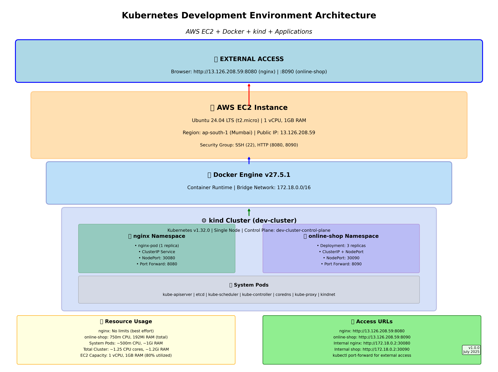

# Kubernetes Local Development Environment Setup

This project demonstrates setting up a complete Kubernetes development environment using **kind** (Kubernetes in Docker) with deployed applications including nginx and an online shop application.

## 📋 Table of Contents

- [Overview](#overview)
- [Prerequisites](#prerequisites)
- [Installation Steps](#installation-steps)
- [Deployed Applications](#deployed-applications)
- [Access URLs](#access-urls)
- [Project Structure](#project-structure)
- [Commands Reference](#commands-reference)
- [Troubleshooting](#troubleshooting)
- [Cleanup](#cleanup)

## 🎯 Overview

This project sets up:
- **Local Kubernetes cluster** using kind
- **nginx web server** with external access
- **Online shop application** with 3 replicas and load balancing
- **Port forwarding** for browser access
- **Multiple service types** (ClusterIP, NodePort)

## 🏗️ Architecture Diagram

### 🖼️ Visual Architecture Overview


*High-resolution architecture diagram showing the complete infrastructure setup*

### 📋 Architecture Components

```
┌─────────────────────────────────────────────────────────────────────────────────┐
│                           🌐 EXTERNAL ACCESS                                    │
│                     Browser: http://13.126.208.59                              │
└─────────────────────────────┬───────────────────────────────────────────────────┘
                              │
┌─────────────────────────────▼───────────────────────────────────────────────────┐
│                        🖥️  AWS EC2 Instance                                    │
│                     Ubuntu 24.04 LTS (t2.micro)                               │
│                                                                                │
│  ┌─────────────────────────────────────────────────────────────────────────┐   │
│  │                    🐳 Docker Engine                                     │   │
│  │                                                                         │   │
│  │  ┌─────────────────────────────────────────────────────────────────┐    │   │
│  │  │                ⚙️  kind Cluster (dev-cluster)                  │    │   │
│  │  │                                                                 │    │   │
│  │  │  ┌─────────────────────────────────────────────────────────┐    │    │   │
│  │  │  │            🎛️  Control Plane Node                      │    │    │   │
│  │  │  │              (dev-cluster-control-plane)               │    │    │   │
│  │  │  │                                                         │    │    │   │
│  │  │  │  ┌─────────────────┐  ┌─────────────────────────────┐   │    │    │   │
│  │  │  │  │   📦 nginx NS   │  │    📦 online-shop NS       │   │    │    │   │
│  │  │  │  │                 │  │                             │   │    │    │   │
│  │  │  │  │  ┌───────────┐  │  │  ┌─────────────────────────┐│   │    │    │   │
│  │  │  │  │  │nginx-pod  │  │  │  │   online-shop-app       ││   │    │    │   │
│  │  │  │  │  │           │  │  │  │     (Deployment)        ││   │    │    │   │
│  │  │  │  │  │🌐 nginx   │  │  │  │                         ││   │    │    │   │
│  │  │  │  │  │:80        │  │  │  │  ┌─────┐ ┌─────┐ ┌─────┐││   │    │    │   │
│  │  │  │  │  │           │  │  │  │  │Pod-1│ │Pod-2│ │Pod-3│││   │    │    │   │
│  │  │  │  │  └───────────┘  │  │  │  │:80  │ │:80  │ │:80  │││   │    │    │   │
│  │  │  │  │                 │  │  │  └─────┘ └─────┘ └─────┘││   │    │    │   │
│  │  │  │  │  ┌───────────┐  │  │  │                         ││   │    │    │   │
│  │  │  │  │  │Services:  │  │  │  │  ┌─────────────────────┐││   │    │    │   │
│  │  │  │  │  │ClusterIP  │  │  │  │  │     Services:       │││   │    │    │   │
│  │  │  │  │  │NodePort   │  │  │  │  │   ClusterIP :80     │││   │    │    │   │
│  │  │  │  │  │:30080     │  │  │  │  │   NodePort  :30090  │││   │    │    │   │
│  │  │  │  │  └───────────┘  │  │  │  └─────────────────────┘││   │    │    │   │
│  │  │  │  └─────────────────┘  │  └─────────────────────────┘│   │    │    │   │
│  │  │  └─────────────────────────────────────────────────────┘    │    │   │
│  │  │                                                              │    │   │
│  │  │  ┌─────────────────────────────────────────────────────┐    │    │   │
│  │  │  │              🔧 System Pods                         │    │    │   │
│  │  │  │  • kube-apiserver    • etcd                         │    │    │   │
│  │  │  │  • kube-scheduler    • coredns                      │    │    │   │
│  │  │  │  • kube-controller   • kube-proxy                   │    │    │   │
│  │  │  │  • kindnet           • local-path-provisioner       │    │    │   │
│  │  │  └─────────────────────────────────────────────────────┘    │    │   │
│  │  └──────────────────────────────────────────────────────────────┘    │   │
│  └─────────────────────────────────────────────────────────────────────────┘   │
│                                                                                │
│  ┌─────────────────────────────────────────────────────────────────────────┐   │
│  │                    🔄 Port Forwarding                                   │   │
│  │  kubectl port-forward nginx-nodeport    8080:80 ──────────────────────┐│   │
│  │  kubectl port-forward online-shop-svc   8090:80 ──────────────────────┘│   │
│  └─────────────────────────────────────────────────────────────────────────┘   │
└─────────────────────────────────────────────────────────────────────────────────┘

┌─────────────────────────────────────────────────────────────────────────────────┐
│                           📊 TRAFFIC FLOW                                       │
│                                                                                 │
│  Internet ──► AWS EC2 ──► Docker ──► kind ──► Kubernetes Services ──► Pods     │
│                                                                                 │
│  🌐 Browser Request                                                             │
│     │                                                                           │
│     ├─► :8080 ──► nginx-nodeport ──► nginx-pod                                 │
│     │                                                                           │
│     └─► :8090 ──► online-shop-svc ──► online-shop-app (3 replicas)             │
│                                                                                 │
└─────────────────────────────────────────────────────────────────────────────────┘

┌─────────────────────────────────────────────────────────────────────────────────┐
│                        🔧 COMPONENT DETAILS                                     │
│                                                                                 │
│  🖥️  AWS EC2 Instance                                                          │
│     • Type: t2.micro (1 vCPU, 1GB RAM)                                        │
│     • OS: Ubuntu 24.04 LTS                                                    │
│     • Public IP: 13.126.208.59                                                │
│     • Region: ap-south-1 (Mumbai)                                             │
│                                                                                 │
│  🐳 Docker Engine                                                              │
│     • Version: 27.5.1                                                         │
│     • Container Runtime for kind                                              │
│                                                                                 │
│  ⚙️  kind (Kubernetes in Docker)                                               │
│     • Version: v0.26.0                                                        │
│     • Kubernetes Version: v1.32.0                                             │
│     • Single Node Cluster                                                     │
│                                                                                 │
│  📦 Applications                                                               │
│     nginx:                                                                     │
│     • Image: nginx:latest                                                     │
│     • Replicas: 1                                                             │
│     • Resources: No limits                                                    │
│                                                                                 │
│     online-shop:                                                               │
│     • Image: trainwithshubham/online_shop_app:latest                          │
│     • Replicas: 3                                                             │
│     • CPU: 250m request, 500m limit (per pod)                                │
│     • Memory: 64Mi request, 128Mi limit (per pod)                            │
│                                                                                 │
│  🌐 Services                                                                   │
│     • ClusterIP: Internal cluster communication                               │
│     • NodePort: External access (30080, 30090)                               │
│     • Port Forwarding: Browser access (8080, 8090)                           │
│                                                                                 │
└─────────────────────────────────────────────────────────────────────────────────┘
```

## 🔧 Prerequisites

- Ubuntu/Linux system
- Internet connection
- Sudo privileges

## 🚀 Installation Steps

### 1. Install Docker

```bash
# Update package index
sudo apt-get update

# Install Docker
sudo apt-get install -y docker.io

# Start Docker service
sudo systemctl start docker

# Add user to docker group
sudo usermod -aG docker $USER

# Enable Docker to start on boot
sudo systemctl enable docker
```

### 2. Install kubectl

```bash
# Download kubectl
curl -LO "https://dl.k8s.io/release/$(curl -L -s https://dl.k8s.io/release/stable.txt)/bin/linux/amd64/kubectl"

# Make executable and move to PATH
chmod +x kubectl
sudo mv kubectl /usr/local/bin/

# Verify installation
kubectl version --client
```

### 3. Install kind (Kubernetes in Docker)

```bash
# Download kind
curl -Lo ./kind https://kind.sigs.k8s.io/dl/v0.26.0/kind-linux-amd64

# Make executable and move to PATH
chmod +x ./kind
sudo mv ./kind /usr/local/bin/kind

# Verify installation
kind version
```

### 4. Create Kubernetes Cluster

```bash
# Create kind cluster
sudo kind create cluster --name dev-cluster

# Export kubeconfig
sudo kind export kubeconfig --name dev-cluster

# Merge with existing kubeconfig
sudo kind get kubeconfig --name dev-cluster > /tmp/kind-config
KUBECONFIG=~/.kube/config:/tmp/kind-config kubectl config view --merge --flatten > /tmp/merged-config
cp /tmp/merged-config ~/.kube/config

# Switch to kind cluster context
kubectl config use-context kind-dev-cluster

# Verify cluster is running
kubectl cluster-info
kubectl get nodes
```

## 🏗️ Deployed Applications

### Application 1: nginx Web Server

#### Namespace and Pod Creation
```yaml
# nginx namespace
apiVersion: v1
kind: Namespace
metadata:
  name: nginx
---
# nginx pod
apiVersion: v1
kind: Pod
metadata:
  name: nginx-pod
  namespace: nginx
spec:
  containers:
  - name: nginx-pod
    image: nginx
    ports:
    - containerPort: 80
```

#### Services
```yaml
# ClusterIP Service
apiVersion: v1
kind: Service
metadata:
  name: nginx-pod
  namespace: nginx
spec:
  type: ClusterIP
  ports:
  - port: 80
    targetPort: 80
  selector:
    app.kubernetes.io/name: nginx-pod
---
# NodePort Service
apiVersion: v1
kind: Service
metadata:
  name: nginx-nodeport
  namespace: nginx
spec:
  type: NodePort
  ports:
  - port: 80
    targetPort: 80
    nodePort: 30080
  selector:
    app.kubernetes.io/name: nginx-pod
```

### Application 2: Online Shop Application

#### Namespace Creation
```yaml
apiVersion: v1
kind: Namespace
metadata:
  name: online-shop
```

#### Deployment with 3 Replicas
```yaml
apiVersion: apps/v1
kind: Deployment
metadata:
  name: online-shop-app
  namespace: online-shop
  labels:
    app: online-shop-app
spec:
  replicas: 3
  selector:
    matchLabels:
      app: online-shop-app
  template:
    metadata:
      labels:
        app: online-shop-app
    spec:
      containers:
      - name: online-shop-app
        image: trainwithshubham/online_shop_app:latest
        ports:
        - containerPort: 80
        resources:
          requests:
            memory: "64Mi"
            cpu: "250m"
          limits:
            memory: "128Mi"
            cpu: "500m"
```

#### Services
```yaml
# ClusterIP Service
apiVersion: v1
kind: Service
metadata:
  name: online-shop-service
  namespace: online-shop
spec:
  type: ClusterIP
  ports:
  - port: 80
    targetPort: 80
  selector:
    app: online-shop-app
---
# NodePort Service
apiVersion: v1
kind: Service
metadata:
  name: online-shop-nodeport
  namespace: online-shop
spec:
  type: NodePort
  ports:
  - port: 80
    targetPort: 80
    nodePort: 30090
  selector:
    app: online-shop-app
```

## 🌐 Access URLs

### nginx Application
- **External Access**: `http://13.126.208.59:8080`
- **NodePort Access**: `http://172.18.0.2:30080`
- **Local Access**: `http://localhost:8080`

### Online Shop Application
- **External Access**: `http://13.126.208.59:8090`
- **NodePort Access**: `http://172.18.0.2:30090`
- **Local Access**: `http://localhost:8090`

## 📁 Project Structure

```
kubernetes-project/
├── README.md
├── manifests/
│   ├── nginx/
│   │   ├── namespace.yaml
│   │   ├── pod.yaml
│   │   ├── service-clusterip.yaml
│   │   └── service-nodeport.yaml
│   └── online-shop/
│       ├── namespace.yaml
│       ├── deployment.yaml
│       ├── service-clusterip.yaml
│       └── service-nodeport.yaml
└── scripts/
    ├── setup-cluster.sh
    ├── deploy-nginx.sh
    ├── deploy-online-shop.sh
    └── cleanup.sh
```

## 📝 Commands Reference

### Cluster Management
```bash
# List all pods in all namespaces
kubectl get pods --all-namespaces

# List pods in specific namespace
kubectl get pods -n nginx
kubectl get pods -n online-shop

# Get detailed pod information
kubectl describe pod <pod-name> -n <namespace>

# Check pod logs
kubectl logs <pod-name> -n <namespace>

# Execute commands in pod
kubectl exec -it <pod-name> -n <namespace> -- /bin/bash
```

### Service Management
```bash
# List all services
kubectl get services --all-namespaces

# Get service details
kubectl describe service <service-name> -n <namespace>

# Port forwarding
kubectl port-forward -n <namespace> service/<service-name> <local-port>:<service-port> --address=0.0.0.0
```

### Deployment Management
```bash
# List deployments
kubectl get deployments -n online-shop

# Scale deployment
kubectl scale deployment online-shop-app --replicas=5 -n online-shop

# Update deployment image
kubectl set image deployment/online-shop-app online-shop-app=trainwithshubham/online_shop_app:v2 -n online-shop

# Check rollout status
kubectl rollout status deployment/online-shop-app -n online-shop
```

### Cluster Information
```bash
# Get cluster info
kubectl cluster-info

# Get nodes
kubectl get nodes

# Get namespaces
kubectl get namespaces

# Get all resources in namespace
kubectl get all -n <namespace>
```

## 🔧 Port Forwarding Setup

### nginx Port Forwarding
```bash
kubectl port-forward -n nginx service/nginx-nodeport 8080:80 --address=0.0.0.0 &
```

### Online Shop Port Forwarding
```bash
kubectl port-forward -n online-shop service/online-shop-service 8090:80 --address=0.0.0.0 &
```

## 📊 Resource Usage

### nginx Application
- **Pods**: 1
- **CPU**: No limits set
- **Memory**: No limits set
- **Storage**: Ephemeral

### Online Shop Application
- **Pods**: 3 replicas
- **CPU Requests**: 250m per pod (750m total)
- **CPU Limits**: 500m per pod (1.5 cores total)
- **Memory Requests**: 64Mi per pod (192Mi total)
- **Memory Limits**: 128Mi per pod (384Mi total)

## 🛠️ Troubleshooting

### Common Issues and Solutions

#### 1. Pods not starting
```bash
# Check pod status
kubectl get pods -n <namespace>

# Check pod events
kubectl describe pod <pod-name> -n <namespace>

# Check pod logs
kubectl logs <pod-name> -n <namespace>
```

#### 2. Service not accessible
```bash
# Check service endpoints
kubectl get endpoints -n <namespace>

# Test service connectivity from within cluster
kubectl run test-pod --image=curlimages/curl -it --rm -- curl http://<service-name>.<namespace>.svc.cluster.local
```

#### 3. Port forwarding issues
```bash
# Kill existing port forwarding
pkill -f "kubectl port-forward"

# Check if port is in use
ss -tlnp | grep <port>

# Restart port forwarding
kubectl port-forward -n <namespace> service/<service-name> <local-port>:<service-port> --address=0.0.0.0 &
```

#### 4. Docker issues
```bash
# Check Docker status
sudo systemctl status docker

# Restart Docker
sudo systemctl restart docker

# Check Docker containers
sudo docker ps
```

## 🧹 Cleanup

### Remove Applications
```bash
# Delete nginx resources
kubectl delete namespace nginx

# Delete online-shop resources
kubectl delete namespace online-shop
```

### Remove Cluster
```bash
# Delete kind cluster
sudo kind delete cluster --name dev-cluster
```

### Remove Tools (Optional)
```bash
# Remove kubectl
sudo rm /usr/local/bin/kubectl

# Remove kind
sudo rm /usr/local/bin/kind

# Remove Docker (if not needed)
sudo apt-get remove docker.io
```

## 📈 Monitoring and Scaling

### Check Resource Usage
```bash
# Get pod resource usage (requires metrics-server)
kubectl top pods -n online-shop

# Get node resource usage
kubectl top nodes
```

### Scaling Applications
```bash
# Scale online shop deployment
kubectl scale deployment online-shop-app --replicas=5 -n online-shop

# Auto-scaling (HPA)
kubectl autoscale deployment online-shop-app --cpu-percent=50 --min=3 --max=10 -n online-shop
```

## 🔐 Security Considerations

- **Network Policies**: Implement network policies to restrict pod-to-pod communication
- **RBAC**: Set up Role-Based Access Control for different users
- **Security Contexts**: Configure security contexts for pods
- **Image Security**: Use specific image tags instead of 'latest'
- **Secrets Management**: Use Kubernetes secrets for sensitive data

## 📚 Additional Resources

- [Kubernetes Official Documentation](https://kubernetes.io/docs/)
- [kind Documentation](https://kind.sigs.k8s.io/)
- [kubectl Cheat Sheet](https://kubernetes.io/docs/reference/kubectl/cheatsheet/)
- [Docker Documentation](https://docs.docker.com/)

## 🤝 Contributing

1. Fork the repository
2. Create a feature branch
3. Make your changes
4. Test thoroughly
5. Submit a pull request

## 📄 License

This project is licensed under the MIT License - see the LICENSE file for details.

---

**Created by**: DevOps Team  
**Last Updated**: July 31, 2025  
**Version**: 1.0.0
